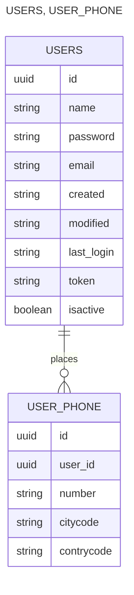

## Requirement
- Java 17+
> [!NOTE]
> How to use

- User management endpoints.

  | Resource                                                 | Purpose                                   | Description                                                     |
  |----------------------------------------------------------|-------------------------------------------|-----------------------------------------------------------------|
  | POST /api/v1/users                                       | Create user with number phones (optional) | Creates a user record and optionally number phones can be added |
  | GET /api/v1/users/{UudId}                                | Read and Get user by Uuid                 | return a JSON object with the user information.                 |
  | GET /api/v1/users/search?name=USER_NAME&email=USER_EMAIL | Read and Search users by name or email    | return a JSON object _**List**_ with the user information.      |
  | PUT /api/v1/users/{UudId}                                | Update user with number phones (optional) | Updates users record and numbers phones                         |
  | DELETE /api/v1/users/{UudId}                             | Delete user with number phones (optional) | Updates users record and numbers phones                         |

- Payloads:
```
POST /api/v1/users
```
```json
{
  "name": "Juan Rodriguez",
  "email": "juan@rodriguez.org",
  "password": "hunter2",
  "phones": [
    {
      "number": "1234567",
      "citycode": "1",
      "contrycode": "57"
    }
  ]
}
```
- Payload Constraint
  - Mandatory fields: Email, Password, Phones.number.
  - Optional fields: Name, Phones, Phones.citycode, Phones.countrycode.
- Response:
- Database Diagram

