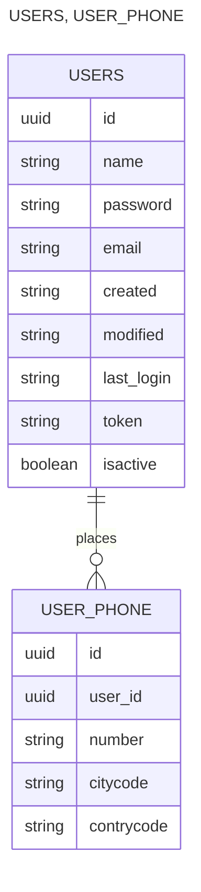

## Requirement
- Java 17+
> [!NOTE]
> How to use

- User management endpoints.

  | Resource                                                 | Purpose                                   | Description                                                     |
  |----------------------------------------------------------|-------------------------------------------|-----------------------------------------------------------------|
  | POST /api/v1/users                                       | Create user with number phones (optional) | Creates a user record and optionally number phones can be added |
  | GET /api/v1/users/{UudId}                                | Read and Get user by Uuid                 | return a JSON object with the user information.                 |
  | GET /api/v1/users/search?name=USER_NAME&email=USER_EMAIL | Read and Search users by name or email    | return a JSON object _**List**_ with the user information.      |
  | PUT /api/v1/users/{UudId}                                | Update user with number phones (optional) | Updates users record and numbers phones                         |
  | DELETE /api/v1/users/{UudId}                             | Delete user with number phones (optional) | Updates users record and numbers phones                         |

- Payloads:
```
POST /api/v1/users
```
```json
{
  "name": "Juan Rodriguez",
  "email": "juan@rodriguez.org",
  "password": "hunter2",
  "phones": [
    {
      "number": "1234567",
      "citycode": "1",
      "contrycode": "57"
    }
  ]
}
```
- Payload Constraint
  - Mandatory fields: Email, Password, Phones.number.
  - Optional fields: Name, Phones, Phones.citycode, Phones.countrycode.
- Response:
```json
{
  "id": "d99e4fae-7791-494b-9fac-a8b678e14353",
  "name": "Juan Rodriguez",
  "email": "juan@rodriguez.org",
  "created": "2024-10-19T07:50:10.425625900",
  "modified": null,
  "token": null,
  "phones": [
    {
      "id": "c4762e1e-59a3-4cf1-9254-341c90eaa7d1",
      "number": "1234567",
      "citycode": "1",
      "countrycode": null
    }
  ],
  "last_login": null,
  "isactive": true
}
```
- Database Diagram


- Password Criteria
  - Regular Expression ``` ^(?=.*[a-z])(?=.*[A-Z])(?=.*\\d)(?=.*[@#$%^&+=]).{8,}$  ```

  | Resource         | Purpose                                               | Description                                                     |
  |------------------|-------------------------------------------------------|-----------------------------------------------------------------|
  | ^                | Indicates the start of the chain                      | Creates a user record and optionally number phones can be added |
  | (?=.*[a-z])      | Make sure there is at least one lowercase letter      | Creates a user record and optionally number phones can be added |
  | (?=.*[A-Z])      | Make sure there is at least one uppercase letter      | Creates a user record and optionally number phones can be added |
  | (?=.*\d)         | Make sure there is at least one digit                 | Creates a user record and optionally number phones can be added |
  | (?=.*[@#$%^&+=]) | Ensures there is at least one symbol: @ # $ % ^ & + = | Creates a user record and optionally number phones can be added |
  | .{8,}            | Indicates the minimum length, 8 characters.           | Creates a user record and optionally number phones can be added |
  | $                | Indicates the end of the string                       | Creates a user record and optionally number phones can be added |
